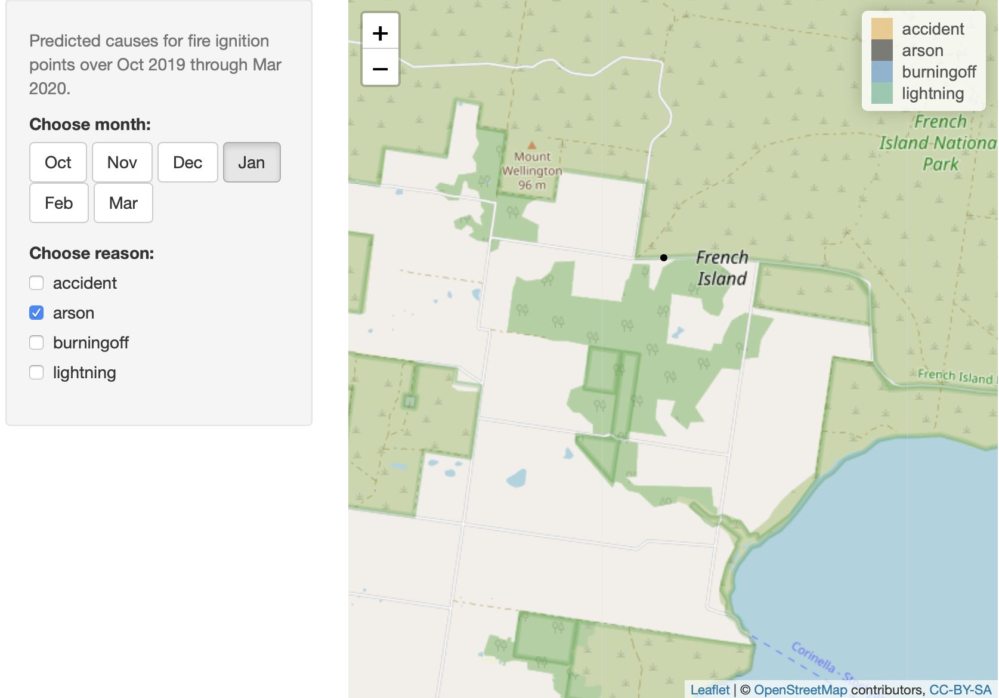

```{r setup, include=FALSE, message=FALSE}
knitr::opts_chunk$set(
  echo = FALSE,
  fig.pos = "H",
  fig.align = "center",
  cache = FALSE,
  message = FALSE,
  warning = FALSE,
  error = FALSE
)
library(knitr)
```

# Introduction {#intro}


The 2019-2020 Australia bushfires, compared with other major bushfires in history, had a more devastating impact on the environment and properties: 3094 houses were destroyed and over 17M hectares of land burned. Fortunately, fewer lives were lost.

A Jan 11, 2020 ABC article "The truth about Australia's fires — arsonists aren't responsible for many this season" reports about Victoria:

> *The Country Fire Authority (CFA) said the majority of fires were not arson-related. 'Most of the fires have been caused by lightning', said Brett Mitchell, the CFA incident controller in Bairnsdale, in East Gippsland. 'Our intelligence suggests there are no deliberate lightings that we are aware of.' Victoria Police had no arson figures available for this bushfire season, but said in the 12 months to September 2019, a dozen people had been arrested for causing bushfires.*

These words were spoken in response to a fierce war of hashtags on Twitter: "#ClimateEmergency" vs "#ArsonEmergency". In the ABC article, most other states quoted numbers for arson and lightning, but Victoria's response was more vague. This prompted us to dig into open data resources to learn as much as we could about the causes of the bushfires in Victoria. 

Historical data collected manually on Victorian fires from 2000-2019 attributes 41% of fires to lightning, 17% to arson, 34% from accidents and 7% from burning off. When this data is combined with information on weather, distance to roads, camp sites, CFA stations, and fuel load, as we might expect, we learn that proximity to human activity, and winds, tends to be the distinguishing factors between the causes. 

Although the cause of the 2019-2020 season fires is not officially known, our model predictions, using satellite hotspots data, weather, distance to roads, camp sites, CFA stations, and fuel load, suggest that 82% of the fires in Victoria can be attributed to lightning. Only 4% due to arson, 14% through accidents, and 1% from burning off. A benefit of the hot spot data is that it provides eyes in locations that are hard for people to get to. Our methodology utilises open data and open source software that could be used for the rest of Australia, too. 

<!-- 
- The headline findings from your data

- A little essential context, such as around the extent of burning from the Black Summer fires

- State your "take-home message" for the reader in a sentence or two. e.g. answer the question "why should readers care about this".
-->


# Data sources and collation {#data}

Historical fire origins data from the Victorian Department of Environment, Land, Water and Planning (DELWP), spanning 2000-2019 summers, suggests that most fires have been caused by lightning. The number of fires has been increasing in recent years, and most of these have been attributed to accidental causes. (This latter observation is possibly disturbing, and should be explained by the relevant authorities.) Arson ignitions appear to be decreasing.

```{r processdata}
library(tidyverse)
library(lubridate)
library(ggthemes)
library(rnaturalearth)
library(patchwork)
au_map <- ne_states(country = 'Australia', returnclass = 'sf')
vic_map <- au_map[7,]

set.seed(357)

# Read in training data
training <- read_csv("data/training.csv")

training <- training %>%
  filter(!CAUSE %in% c("BURNING BUILDING",
                       "WASTE DISPOSAL, INDUSTRIAL, SAWMILL, TIP",
                       "WASTE DISPOSAL, DOMESTIC",
                       "BURNING VEHICLE, MACHINE",
                       "BURNING BUILDING")) %>%
  filter(new_cause != "other") %>%
  filter(new_cause != "relight")


training <- select(training, -c(EVENTID:FIRE_NUM), -id, -CAUSE, -FOREST, -FOR_CODE, -FOR_CAT)

training <- mutate(training,
                   year = factor(year(FIRE_START)),
                   month = factor(month(FIRE_START), levels = c(10,11,12,1,2,3)),
                   day = factor(day(FIRE_START), levels = c(1:31)),
                   wod = factor(wday(FIRE_START), levels = c(1:7)))

training <- filter(training, month %in% c(10,11,12,1,2,3))

training <- na.omit(training)

training <- training %>% 
  mutate(new_cause = ifelse(new_cause == "accidental_human", "accident", new_cause)) %>%
  mutate(new_cause = ifelse(new_cause == "burning_off_human", "burning_off", new_cause)) %>%
  mutate(new_cause = factor(new_cause)) %>%
  mutate(FOR_TYPE = factor(FOR_TYPE))

#training <- na.omit(training)

training <- mutate(training,
                   log_dist_cfa = log(dist_cfa),
                   log_dist_camp = log(dist_camp),
                   log_dist_road = log(dist_road),
                   COVER = factor(COVER),
                   HEIGHT = factor(HEIGHT))

training <- rename(training, cause = new_cause)
training <- mutate(training,
                   cause = fct_relevel(cause,
                                       "lightning",
                                       "accident",
                                       "arson",
                                       "burning_off")) %>%
    mutate(cause = factor(tools::toTitleCase(as.character(cause)), 
        levels = c("Lightning", "Accident", "Arson", "Burning_off"))) 

training <- na.omit(training)

# Predictions
prediction <- read_csv("data/prediction_2019-2020.csv") %>%
  mutate(cause = factor(tools::toTitleCase(cause), 
    levels = c("Lightning", "Accident", "Arson", "Burning_off")))


# Tabulate causes
training_p <- training %>%
  group_by(cause) %>%
  summarise(n=n()) %>%
  mutate(freq = round(n / sum(n), 2)*100) %>%
  mutate(lon = 148, lat = -35)
pred_p <- prediction %>%
  group_by(cause) %>%
  summarise(n=n()) %>%
  mutate(freq = round(n / sum(n), 2)*100) %>%
  mutate(lon = 148, lat = -35)
  
```

```{r fireorigins, fig.width=10, fig.height=5, out.width="100%", fig.cap="Causes of fires from 2000-2019. Lightning is most common cause. The number of fires is increasing, and this is mostly due to accidents."}
p1 <- training %>%
        mutate(cause = factor(tools::toTitleCase(as.character(cause)), 
     levels = c("Lightning", "Accident", "Arson", "Burning_off"))) %>%
    ggplot() +
     geom_histogram(aes(cause, fill = cause), stat = "count") +
    theme_minimal(base_size = 14) +
    ggtitle("Counts of ignitions by cause") +
    theme(legend.position = "none") +
    scale_fill_brewer(palette = "RdBu") +
    xlab("Cause") +
    ylab("Count") 
  
p2 <- training %>%
  mutate(cause = factor(tools::toTitleCase(as.character(cause)), levels = c("Lightning", "Accident", "Arson", "Burning_off"))) %>%
    ggplot() +
  geom_bar(data = select(training, -cause), aes(as.Date(paste0(as.character(year), "-01-01")))) +
    geom_bar(aes(as.Date(paste0(as.character(year), "-01-01")), fill = cause)) +
    facet_wrap(~cause) +
    theme_minimal(base_size = 14) +
    ggtitle("Ignitions by year, by cause") +
    theme(legend.position = "none") +
    scale_fill_brewer(palette = "RdBu") +
    xlab("Year") +
    ylab("Count") +
    scale_x_date(date_labels = "%y")

p1 + p2  
```

To track bushfires in Australia remotely with high temporal and spatial resolution, we used hotspot data taken from the Himawari-8 satellite. This data was filtered using the firepower information to keep only hotspots that were most likely fires. We clustered the hotspots in time and space to estimate the ignition point and time of fires, and to label individual fires. This data was supplemented with data from other sources: temperature, rainfall, wind, solar exposure, fuel load, as well as distance to camp sites, roads and CFA stations. Rainfall was aggregated at different time intervals to provide cumulative moisture for locations. 

A model was trained to predict one of four causes (lightning, accident, arson, burning off) on the historical data, which was supplemented with the same weather, fuel layer, and distances data as the hot spot data. The performance of the model was very good: 75% overall accuracy, 90% accurate on lightning, 78% for accidents, and 54% for arson, which was mostly confused with accident, as would make sense. The most important contributors to distinguishing between lightning and arson (or accident) ignition were distances to CFA stations, roads and camp sites, and average wind speed over the past 12-24 months. Smaller distances were most likely arson or accident, as might be expected.

# Model predictions {#models}

The model predicts the majority of fires in the 2019-2020 bushfires to be due to lightning. Most of the fires were located in densely vegetated areas of the state, inaccessible by road, which is similar to the historical locations. 

```{r maps, fig.width=10, fig.height=5, out.width="100%", fig.cap="Spatial distribution of causes of fires from 2000-2019, and predictions for 2019-2020 season."}
p3 <- training %>%
  ggplot() +
      #geom_density_2d(aes(x=lon, y=lat, colour=cause), contour_var = "ndensity") +
      geom_sf(data = vic_map, fill = "grey98", col = "black") +
      geom_point(aes(x=lon, y=lat, colour=cause), alpha=0.1) + 
      facet_wrap(~cause, ncol=4) +
      scale_colour_brewer(palette = "RdBu") +
      geom_text(data=training_p, aes(x=lon, y=lat, label=paste0(freq, "%")), size=6) + 
      ggtitle("Historical causes collected manually") +
    theme_map(base_size = 14) +
    theme(legend.position = "none",
          plot.margin = unit(c(0, 0, 0, 0), "pt")) +
    guides(fill = guide_legend(reverse = T)) 

p4 <- ggplot() +
  geom_sf(data = vic_map, fill = "grey98", col = "black") +
  geom_point(data=prediction, aes(x=lon, y=lat, colour = cause), alpha = 0.5) +
  scale_colour_brewer(palette = "RdBu") +
  facet_wrap(~cause, ncol=4) +
  geom_text(data=pred_p, aes(x=lon, y=lat, label=paste0(freq, "%")), size=6) + 
  ggtitle("2019-2020 predictions, using ignition location from hotspots") +
  theme_map(base_size = 14) +
  theme(legend.position = "none") 

p3 / p4
```

When the fire ignitions are examined by month during the season, it can be seen that lightning ignition has occurred throughout the summer. All of the fires in February were predicted to be due to lightning. Accident and arson were commonly predicted causes in March, and early in the season. Reassuringly, ignition due to burning off was predicted primarily in October, prior to the fire restrictions. 

```{r monthlymaps, fig.width=10, fig.height=5, out.width="100%", fig.cap="Spatio-temporal distribution of cause predictions for 2019-2020 season. Reassuringly, fires due to burning off primarily occured in October, prior to fire restrictions. February fires were all predicted to be due to lightning."}

p5 <- prediction %>%
  mutate(mon = month(time, label = TRUE)) %>%
  mutate(mon = factor(mon, levels = c("Oct", "Nov", "Dec", "Jan", "Feb", "Mar"))) %>%
  ggplot() +
  geom_sf(data = vic_map, fill = "grey98", col = "black") +
  geom_point(aes(x=lon, y=lat, colour = cause), size=2) +
  scale_colour_brewer(palette = "RdBu") +
  facet_grid(cause~mon) +
  #ggtitle("2019-2020 predictions, using ignition location from hotspots") +
  theme_map(base_size = 14) +
  theme(legend.position = "none") 
p5 
```

# Validation of predictions {-}

In order to validate predictions, we have searched media releases and descriptions. Information is sparse to non-existent. Wikipedia's page [2019–20 Australian bushfire season](https://en.wikipedia.org/wiki/2019–20_Australian_bushfire_season) reports 

>"On 21 November 2019, lightning strikes ignited a series of fires in East Gippsland"

which is consistent with our predictions.  

Close to Melbourne there was disturbing news of a bushfire in a high density koala habitat on French Island on Jan 18. [Mornington Peninsula News](http://www.mpnews.com.au/2020/01/21/all-clear-after-island-fire-fright/) reports: 

> *Dry lightning is being blamed for the blaze which was thought to have started on the previous Wednesday and smouldered for three days before an east-wind change brought it surging to life.*

Contrary to this, our model predicts this to be arson or accident with 72% confidence. The other data about this ignition, used in our model prediction, was that it is non-forest, 3m to a road, quite a warm day (21-37$^o$C), moderate winds and no rain. If we zoom into a map of the area to the first detected hotspot it can be seen to be right near a road, making plausible evidence for this to actually have been a human-caused fire. 



# Summary

In summary, the  ability to detect fire starts from remotely sensed hot spots makes it possible to more rapidly predict fire cause, particularly when combined with weather, distance to human activity, and vegetation information. Our analysis using open data supports that lightning is the most common cause of bushfires in Victoria.

# Acknowledgements

This analysis is based on a research paper co-authored by Professor Di Cook and Weihao Li, a Monash University Honours student, from the Department of Econometrics and Business Statistics at the Monash Business School, and Emily Dodwell, former Principal Inventive Scientist at AT&T Labs Research in New York City. The full analysis is available at https://github.com/TengMCing/bushfire-conversation. The Australian Centre of Excellence for Mathematical and Statistical Frontiers supported Emily's travel to Australia to start this project.

The code used for the analysis can be found in the github repository [github.com/TengMCing/thesis](https://github.com/TengMCing/thesis).

You can explore the historical fire data, predictions for 2019-2020 fires, and a fire risk map for Victoria using the shiny app at [ebsmonash.shinyapps.io/VICfire/](https://ebsmonash.shinyapps.io/VICfire/)
